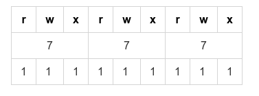
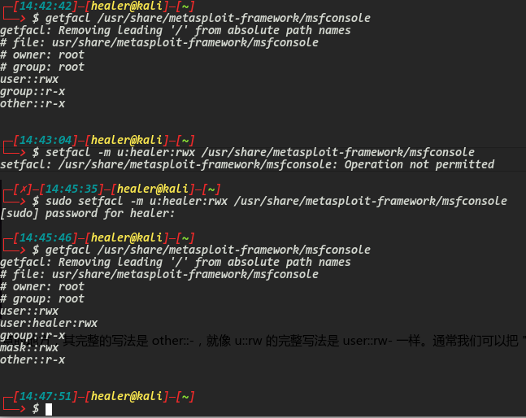
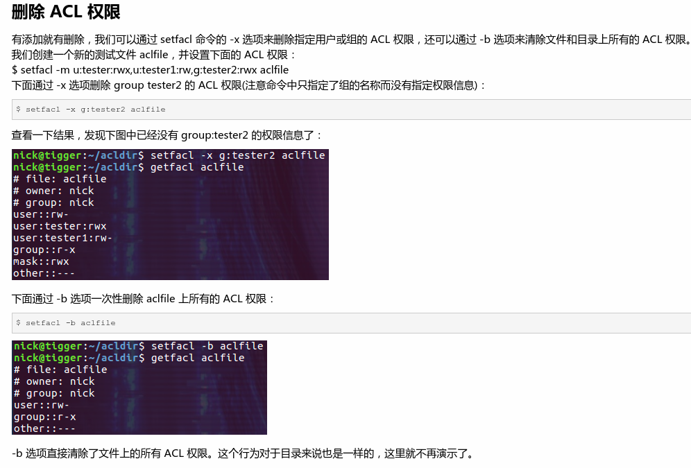

# Linux系统权限控制

## 方法一

命令：`chmod 777 filename`

这里的数值的意思：每一个写成二进制之后，对应读、写、执行

## 方法二

命令： `chmod a+x filename`

## 方法三

命令：`sudo setfacl -m u:healer:rwx /usr/share/metasploit-framework/msfconsole`

通过上面的这个办法，解决了普通用户healer每次启动msfconsole的时候都需要输入密码的问题

### 删除权限

懒得去做了，看截图吧：

