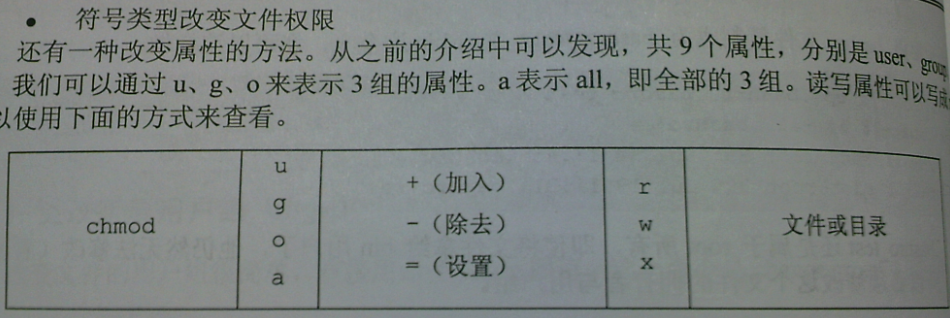
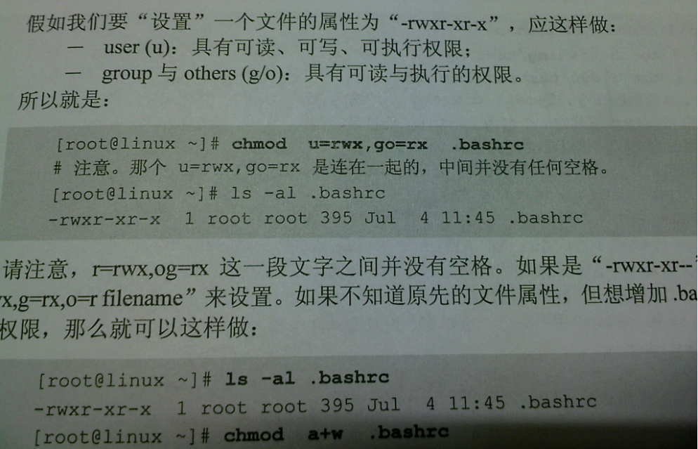

# Linux系统权限控制

## 方法一

命令：`chmod 777 filename`

这里的数值的意思：每一个写成二进制之后，对应读、写、执行

<table>
    <tr>
        <th>r</th>
        <th>w</th>
        <th>x</th>
        <th>r</th>
        <th>w</th>
        <th>x</th>
        <th>r</th>
        <th>w</th>
        <th>x</th>
    </tr>
    <tr>
        <td align="center" colspan="3"> 7 </td>
        <td align="center" colspan="3"> 7 </td>
        <td align="center" colspan="3"> 7 </td>
    </tr>
    <tr>
        <td>1</td>
        <td>1</td>
        <td>1</td>
        <td>1</td>
        <td>1</td>
        <td>1</td>
        <td>1</td>
        <td>1</td>
        <td>1</td>
    </tr>
</table>

## 方法二

命令： `chmod a+x filename`

