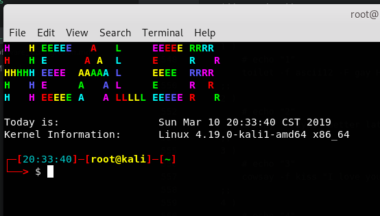
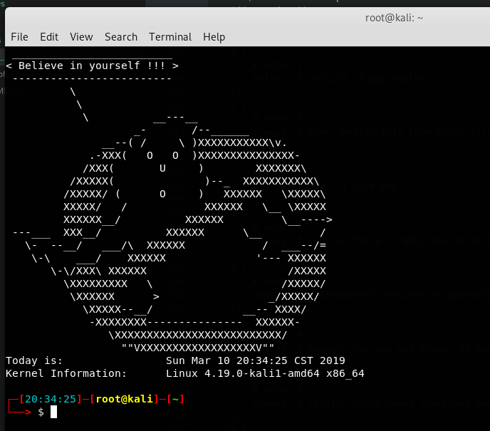

# **配置终端美化**

首先要指出的是终端样式设置文件（可能是这么叫的吧）是`.bashrc`文件，我的是kali linux系统，这个文件的位置是在我的root目录下（使用的root）用户，通过修改文件中的`PS1`变量可以改变打开终端的时候的显示样式

---

有的时候新装的系统换了我最后的那个配置文件之后会报一个错误是
`pyenv : commend not found`

解决措施：
`git clone https://github.com/yyuu/pyenv.git ~/.pyenv`

下面是正文

---

> 语法都是Linux Shell脚本文件语法，不熟悉的可以自己补一下

## 原配置文件

```shell
# ~/.bashrc: executed by bash(1) for non-login shells.
# see /usr/share/doc/bash/examples/startup-files (in the package bash-doc)
# for examples

# If not running interactively, don't do anything
case $- in
    *i*) ;;
      *) return;;
esac

# don't put duplicate lines or lines starting with space in the history.
# See bash(1) for more options
HISTCONTROL=ignoreboth

# append to the history file, don't overwrite it
shopt -s histappend

# for setting history length see HISTSIZE and HISTFILESIZE in bash(1)
HISTSIZE=1000
HISTFILESIZE=2000

# check the window size after each command and, if necessary,
# update the values of LINES and COLUMNS.
shopt -s checkwinsize

# If set, the pattern "**" used in a pathname expansion context will
# match all files and zero or more directories and subdirectories.
#shopt -s globstar

# make less more friendly for non-text input files, see lesspipe(1)
#[ -x /usr/bin/lesspipe ] && eval "$(SHELL=/bin/sh lesspipe)"

# set variable identifying the chroot you work in (used in the prompt below)
if [ -z "${debian_chroot:-}" ] && [ -r /etc/debian_chroot ]; then
    debian_chroot=$(cat /etc/debian_chroot)
fi

# set a fancy prompt (non-color, unless we know we "want" color)
case "$TERM" in
    xterm-color) color_prompt=yes;;
esac

# uncomment for a colored prompt, if the terminal has the capability; turned
# off by default to not distract the user: the focus in a terminal window
# should be on the output of commands, not on the prompt
force_color_prompt=yes

if [ -n "$force_color_prompt" ]; then
    if [ -x /usr/bin/tput ] && tput setaf 1 >&/dev/null; then
	# We have color support; assume it's compliant with Ecma-48
	# (ISO/IEC-6429). (Lack of such support is extremely rare, and such
	# a case would tend to support setf rather than setaf.)
	color_prompt=yes
    else
	color_prompt=
    fi
fi

if [ "$color_prompt" = yes ]; then
    PS1='${debian_chroot:+($debian_chroot)}\[\033[01;31m\]\u@\h\[\033[00m\]:\[\033[01;34m\]\w\[\033[00m\]\$ '
else
    PS1='${debian_chroot:+($debian_chroot)}\u@\h:\w\$ '
fi
unset color_prompt force_color_prompt

# If this is an xterm set the title to user@host:dir
case "$TERM" in
xterm*|rxvt*)
    PS1="\[\e]0;${debian_chroot:+($debian_chroot)}\u@\h: \w\a\]$PS1"
    ;;
*)
    ;;
esac

# enable color support of ls and also add handy aliases
if [ -x /usr/bin/dircolors ]; then
    test -r ~/.dircolors && eval "$(dircolors -b ~/.dircolors)" || eval "$(dircolors -b)"
    alias ls='ls --color=auto'
    #alias dir='dir --color=auto'
    #alias vdir='vdir --color=auto'

    #alias grep='grep --color=auto'
    #alias fgrep='fgrep --color=auto'
    #alias egrep='egrep --color=auto'
fi

# some more ls aliases
#alias ll='ls -l'
#alias la='ls -A'
#alias l='ls -CF'

# Alias definitions.
# You may want to put all your additions into a separate file like
# ~/.bash_aliases, instead of adding them here directly.
# See /usr/share/doc/bash-doc/examples in the bash-doc package.

if [ -f ~/.bash_aliases ]; then
    . ~/.bash_aliases
fi

# enable programmable completion features (you don't need to enable
# this, if it's already enabled in /etc/bash.bashrc and /etc/profile
# sources /etc/bash.bashrc).
if ! shopt -oq posix; then
  if [ -f /usr/share/bash-completion/bash_completion ]; then
    . /usr/share/bash-completion/bash_completion
  elif [ -f /etc/bash_completion ]; then
    . /etc/bash_completion
  fi
fi
export PATH=~/.pyenv/bin:$PATH
export PYENV_ROOT=~/.pyenv
eval "$(pyenv init -)"
```


## 添加打开时的动画效果

> 复制到上面的文件末尾就可以了

这就是通过系统的时间（秒数）除以10,取余数，产生十种可能性，每种可能性对应一个图案

需要用到两个插件`cowsay`和`toilet`，记得好像都用`apt-get install`就后可以装上了

```shell
# *****************edit by healer after*********************
#cowsay -f ghostbusters "HEALER"

second=`date +%s`
# echo $currentTimeStamp
Num=$((second%10))

case $Num in
	1 )
		# echo "1"
		toilet -f ascii12 -F gay Healer
	;;
	2 )
		# echo "2"
		cowsay -f eyes "Better late than NEVER !!!"
	;;
	3 )
		# echo "3"
		cowsay -f kiss "I love you !!!"
	;;
	4 )
		# echo "4"
		cowsay -f turtle "There is ONLY one me in this world !!!"
	;;
	5 )
		# echo "5"
		cowsay -f ghostbusters "Believe in yourself !!!"
	;;
	6 )
		# echo "6"
		cowsay -f daemon "You are not brave, no one for you to be strong !!!"
	;;
	7 )
		# echo "7"
		cowsay -f calvin "Youth means limitless possibilities !!!"
	;;
	8 )
		# echo "8"
		cowsay -f tux "Knowledge is power !!! "
	;;
	9 )
		# echo "9"
		toilet -f ascii12 -F border Healer
	;;
	0 )
		# echo "0"
		toilet -f letter -F gay Healer
	;;
esac
echo -ne "${lightgreen}Today is:\t\t${red}" `date`; echo ""
echo -e "${lightgreen}Kernel Information: \t${red}" `uname -smr`
```

## 大佬的配置

[大佬的链接](https://github.com/slomkowski/bash-full-of-colors/blob/master/bashrc.sh "BASHRC")
> 原链接找不到了，上面的这个和我当时看到的比较类似

我当时看到的配置文件如下，不知道是哪个大佬的
```shel
#
# ~/.bashrc
#

# If not running interactively, don't do anything
[[ $- != *i* ]] && return

# Git awesomeness
function parse_git_branch {
    ref=$(git symbolic-ref HEAD 2> /dev/null) || return
    echo "("${ref#refs/heads/}")"
}

# Setup sync between two folders
alias rsync='rsync -a --delete'

# Let's get some colors in here
alias ls='ls --color=auto'

# Pacman stuff
alias update='sudo pacman -Syu'
alias install='sudo pacman -S'

# System commands
alias shutdown='sudo shutdown -h now'
alias restart='sudo reboot'

# Ports
alias ports='netstat -tulanp'

# CPU Usages
alias pscpu='ps auxf | sort -nr -k 3'
alias pscpu10='ps auxf | sort -nr -k 3 | head -10'

### Disk Utilities

# Grabs disk usage in current directory
alias diskUsage='du -ch | grep total'

# Grabs total usage in your system
alias totalusage='df -hl --total | grep total'

# Grabs usage with partition information
alias partusage='df -hlT --exclude-type=tmpfs --exclude-type=devtmpfs'

# Tells you what is using the most space
alias most='du -hsx * | sort -rh | head -10'

### System Information

# Kernel Version
alias kversion='uname -a'

# Name and Version of Distro
alias nandv='head -n1 /etc/issue'

# CPU Information
alias mycpu='grep "model name" /proc/cpuinfo'

# Regular Colors
Black="\[\033[0;30m\]"        # Black
Red="\[\033[0;31m\]"          # Red
Green="\[\033[0;32m\]"        # Green
Yellow="\[\033[0;33m\]"       # Yellow
Blue="\[\033[0;34m\]"         # Blue
Purple="\[\033[0;35m\]"       # Purple
Cyan="\[\033[0;36m\]"         # Cyan
White="\[\033[0;37m\]"        # White

# Bold
BBlack="\[\033[1;30m\]"       # Black
BRed="\[\033[1;31m\]"         # Red
BGreen="\[\033[1;32m\]"       # Green
BYellow="\[\033[1;33m\]"      # Yellow
BBlue="\[\033[1;34m\]"        # Blue
BPurple="\[\033[1;35m\]"      # Purple
BCyan="\[\033[1;36m\]"        # Cyan
BWhite="\[\033[1;37m\]"       # White

# Underline
UBlack="\[\033[4;30m\]"       # Black
URed="\[\033[4;31m\]"         # Red
UGreen="\[\033[4;32m\]"       # Green
UYellow="\[\033[4;33m\]"      # Yellow
UBlue="\[\033[4;34m\]"        # Blue
UPurple="\[\033[4;35m\]"      # Purple
UCyan="\[\033[4;36m\]"        # Cyan
UWhite="\[\033[4;37m\]"       # White

# Background
On_Black="\[\033[40m\]"       # Black
On_Red="\[\033[41m\]"         # Red
On_Green="\[\033[42m\]"       # Green
On_Yellow="\[\033[43m\]"      # Yellow
On_Blue="\[\033[44m\]"        # Blue
On_Purple="\[\033[45m\]"      # Purple
On_Cyan="\[\033[46m\]"        # Cyan
On_White="\[\033[47m\]"       # White

# High Intensty
IBlack="\[\033[0;90m\]"       # Black
IRed="\[\033[0;91m\]"         # Red
IGreen="\[\033[0;92m\]"       # Green
IYellow="\[\033[0;93m\]"      # Yellow
IBlue="\[\033[0;94m\]"        # Blue
IPurple="\[\033[0;95m\]"      # Purple
ICyan="\[\033[0;96m\]"        # Cyan
IWhite="\[\033[0;97m\]"       # White

# Bold High Intensty
BIBlack="\[\033[1;90m\]"      # Black
BIRed="\[\033[1;91m\]"        # Red
BIGreen="\[\033[1;92m\]"      # Green
BIYellow="\[\033[1;93m\]"     # Yellow
BIBlue="\[\033[1;94m\]"       # Blue
BIPurple="\[\033[1;95m\]"     # Purple
BICyan="\[\033[1;96m\]"       # Cyan
BIWhite="\[\033[1;97m\]"      # White

# High Intensty backgrounds
On_IBlack="\[\033[0;100m\]"   # Black
On_IRed="\[\033[0;101m\]"     # Red
On_IGreen="\[\033[0;102m\]"   # Green
On_IYellow="\[\033[0;103m\]"  # Yellow
On_IBlue="\[\033[0;104m\]"    # Blue
On_IPurple="\[\033[10;95m\]"  # Purple
On_ICyan="\[\033[0;106m\]"    # Cyan
On_IWhite="\[\033[0;107m\]"   # White

if [[ ${EUID} == 0 ]] ; then
  sq_color=$BRed
else
  sq_color=$BBlue
fi

export PS1="\n$sq_color\342\224\214\342\224\200\$([[ \$? != 0 ]] && echo \"[$BRed\342\234\227$sq_color]\342\224\200\")[$Cyan\@$sq_color]\342\224\200[\[\033[01;37m\]\u@\h$sq_color]\342\224\200[$BGreen\w$sq_color]\n$sq_color\342\224\224\342\224\200\342\224\200> $Yellow\$(parse_git_branch)$White\$ "
```

## 网上bash的教程知识点


[参考链接](https://blog.csdn.net/iweaming/article/details/49786725 "BASH")
具体的一些知识点在链接里面找吧，基本上还是比较全面的。


## 自己修改的部分

了解了上面的知识点之后，就可以自己改一点东西了，本来以为直接用大佬的配置文件就可以了，但是最后会报错，他的应该是针对他的系统写的，我的kali还是有些不同的，bash的终端能够美化成功，但是在终端中输入`zsh`的时候打开的终端会显示一堆错误信息，于是就自己看了看上面的知识点


我是根据kali的源文件，和上面大佬的配置融合了一下保证不影响kali的正常显示
```shell
# ~/.bashrc: executed by bash(1) for non-login shells.
# see /usr/share/doc/bash/examples/startup-files (in the package bash-doc)
# for examples

# If not running interactively, don't do anything
case $- in
    *i*) ;;
      *) return;;
esac

# don't put duplicate lines or lines starting with space in the history.
# See bash(1) for more options
HISTCONTROL=ignoreboth

# append to the history file, don't overwrite it
shopt -s histappend

# for setting history length see HISTSIZE and HISTFILESIZE in bash(1)
HISTSIZE=1000
HISTFILESIZE=2000

# check the window size after each command and, if necessary,
# update the values of LINES and COLUMNS.
shopt -s checkwinsize

# If set, the pattern "**" used in a pathname expansion context will
# match all files and zero or more directories and subdirectories.
#shopt -s globstar

# make less more friendly for non-text input files, see lesspipe(1)
#[ -x /usr/bin/lesspipe ] && eval "$(SHELL=/bin/sh lesspipe)"

# set variable identifying the chroot you work in (used in the prompt below)
if [ -z "${debian_chroot:-}" ] && [ -r /etc/debian_chroot ]; then
    debian_chroot=$(cat /etc/debian_chroot)
fi

# set a fancy prompt (non-color, unless we know we "want" color)
case "$TERM" in
    xterm-color) color_prompt=yes;;
esac

# uncomment for a colored prompt, if the terminal has the capability; turned
# off by default to not distract the user: the focus in a terminal window
# should be on the output of commands, not on the prompt
force_color_prompt=yes

if [ -n "$force_color_prompt" ]; then
    if [ -x /usr/bin/tput ] && tput setaf 1 >&/dev/null; then
	# We have color support; assume it's compliant with Ecma-48
	# (ISO/IEC-6429). (Lack of such support is extremely rare, and such
	# a case would tend to support setf rather than setaf.)
	color_prompt=yes
    else
	color_prompt=
    fi
fi

# Regular Colors
Black="\[\033[0;30m\]"        # Black
Red="\[\033[0;31m\]"          # Red
Green="\[\033[0;32m\]"        # Green
Yellow="\[\033[0;33m\]"       # Yellow
Blue="\[\033[0;34m\]"         # Blue
Purple="\[\033[0;35m\]"       # Purple
Cyan="\[\033[0;36m\]"         # Cyan
White="\[\033[0;37m\]"        # White

# Bold
BBlack="\[\033[1;30m\]"       # Black
BRed="\[\033[1;31m\]"         # Red
BGreen="\[\033[1;32m\]"       # Green
BYellow="\[\033[1;33m\]"      # Yellow
BBlue="\[\033[1;34m\]"        # Blue
BPurple="\[\033[1;35m\]"      # Purple
BCyan="\[\033[1;36m\]"        # Cyan
BWhite="\[\033[1;37m\]"       # White

# Underline
UBlack="\[\033[4;30m\]"       # Black
URed="\[\033[4;31m\]"         # Red
UGreen="\[\033[4;32m\]"       # Green
UYellow="\[\033[4;33m\]"      # Yellow
UBlue="\[\033[4;34m\]"        # Blue
UPurple="\[\033[4;35m\]"      # Purple
UCyan="\[\033[4;36m\]"        # Cyan
UWhite="\[\033[4;37m\]"       # White

# Background
On_Black="\[\033[40m\]"       # Black
On_Red="\[\033[41m\]"         # Red
On_Green="\[\033[42m\]"       # Green
On_Yellow="\[\033[43m\]"      # Yellow
On_Blue="\[\033[44m\]"        # Blue
On_Purple="\[\033[45m\]"      # Purple
On_Cyan="\[\033[46m\]"        # Cyan
On_White="\[\033[47m\]"       # White

# High Intensty
IBlack="\[\033[0;90m\]"       # Black
IRed="\[\033[0;91m\]"         # Red
IGreen="\[\033[0;92m\]"       # Green
IYellow="\[\033[0;93m\]"      # Yellow
IBlue="\[\033[0;94m\]"        # Blue
IPurple="\[\033[0;95m\]"      # Purple
ICyan="\[\033[0;96m\]"        # Cyan
IWhite="\[\033[0;97m\]"       # White

# Bold High Intensty
BIBlack="\[\033[1;90m\]"      # Black
BIRed="\[\033[1;91m\]"        # Red
BIGreen="\[\033[1;92m\]"      # Green
BIYellow="\[\033[1;93m\]"     # Yellow
BIBlue="\[\033[1;94m\]"       # Blue
BIPurple="\[\033[1;95m\]"     # Purple
BICyan="\[\033[1;96m\]"       # Cyan
BIWhite="\[\033[1;97m\]"      # White

# High Intensty backgrounds
On_IBlack="\[\033[0;100m\]"   # Black
On_IRed="\[\033[0;101m\]"     # Red
On_IGreen="\[\033[0;102m\]"   # Green
On_IYellow="\[\033[0;103m\]"  # Yellow
On_IBlue="\[\033[0;104m\]"    # Blue
On_IPurple="\[\033[10;95m\]"  # Purple
On_ICyan="\[\033[0;106m\]"    # Cyan
On_IWhite="\[\033[0;107m\]"   # White

if [[ ${EUID} == 0 ]] ; then
  sq_color=$BRed
else
  sq_color=$BBlue
fi

if [ "$color_prompt" = yes ]; then
    PS1="${debian_chroot:+($debian_chroot)}\n$sq_color\342\224\214\342\224\200\$([[ \$? != 0 ]] && echo \"[$BRed\342\234\227$sq_color]\342\224\200\")[$Cyan\t$sq_color]\342\224\200[\[\033[01;37m\]$BYellow\u@\h$sq_color]\342\224\200[$BGreen\w$sq_color]\n$sq_color\342\224\224\342\224\200\342\224\200> $White\$ "
else
    PS1='${debian_chroot:+($debian_chroot)}\u@\h:\w\$ '
fi
unset color_prompt force_color_prompt

# If this is an xterm set the title to user@host:dir
case "$TERM" in
xterm*|rxvt*)
    PS1="\[\e]0;${debian_chroot:+($debian_chroot)}\u@\h: \w\a\]$PS1"
    ;;
*)
    ;;
esac

# enable color support of ls and also add handy aliases
if [ -x /usr/bin/dircolors ]; then
    test -r ~/.dircolors && eval "$(dircolors -b ~/.dircolors)" || eval "$(dircolors -b)"
    alias ls='ls --color=auto'
    #alias dir='dir --color=auto'
    #alias vdir='vdir --color=auto'

    #alias grep='grep --color=auto'
    #alias fgrep='fgrep --color=auto'
    #alias egrep='egrep --color=auto'
fi

# some more ls aliases
#alias ll='ls -l'
#alias la='ls -A'
#alias l='ls -CF'

# Alias definitions.
# You may want to put all your additions into a separate file like
# ~/.bash_aliases, instead of adding them here directly.
# See /usr/share/doc/bash-doc/examples in the bash-doc package.

if [ -f ~/.bash_aliases ]; then
    . ~/.bash_aliases
fi

# enable programmable completion features (you don't need to enable
# this, if it's already enabled in /etc/bash.bashrc and /etc/profile
# sources /etc/bash.bashrc).
if ! shopt -oq posix; then
  if [ -f /usr/share/bash-completion/bash_completion ]; then
    . /usr/share/bash-completion/bash_completion
  elif [ -f /etc/bash_completion ]; then
    . /etc/bash_completion
  fi
fi
export PATH=~/.pyenv/bin:$PATH
export PYENV_ROOT=~/.pyenv
eval "$(pyenv init -)"

# *****************edit by healer after*********************
#cowsay -f ghostbusters "HEALER"

second=`date +%s`
# echo $currentTimeStamp
Num=$((second%10))

case $Num in
	1 )
		# echo "1"
		toilet -f ascii12 -F gay Healer
	;;
	2 )
		# echo "2"
		cowsay -f eyes "Better late than NEVER !!!"
	;;
	3 )
		# echo "3"
		cowsay -f kiss "I love you !!!"
	;;
	4 )
		# echo "4"
		cowsay -f turtle "There is ONLY one me in this world !!!"
	;;
	5 )
		# echo "5"
		cowsay -f ghostbusters "Believe in yourself !!!"
	;;
	6 )
		# echo "6"
		cowsay -f daemon "You are not brave, no one for you to be strong !!!"
	;;
	7 )
		# echo "7"
		cowsay -f calvin "Youth means limitless possibilities !!!"
	;;
	8 )
		# echo "8"
		cowsay -f tux "Knowledge is power !!! "
	;;
	9 )
		# echo "9"
		toilet -f ascii12 -F border Healer
	;;
	0 )
		# echo "0"
		toilet -f letter -F gay Healer
	;;
esac
echo -ne "${lightgreen}Today is:\t\t${red}" `date`; echo ""
echo -e "${lightgreen}Kernel Information: \t${red}" `uname -smr`
```




有十种可能我就不一一尝试了，`cowsay`中提供的团有那么几十个，为了方便查看所有的图案，挑选几个自己喜欢的，就写了一个简单的shell脚本，直接一次性全部显示，脚本如下
```shell
#!/bin/bash

for i in `ls /usr/share/cowsay/cows`
do
	echo "***********"
	echo $i
	echo "***********"
	cowsay -f $i "healer"
done
```

_没什么技术含量，就是记录一下自己的成长过程_
