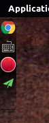
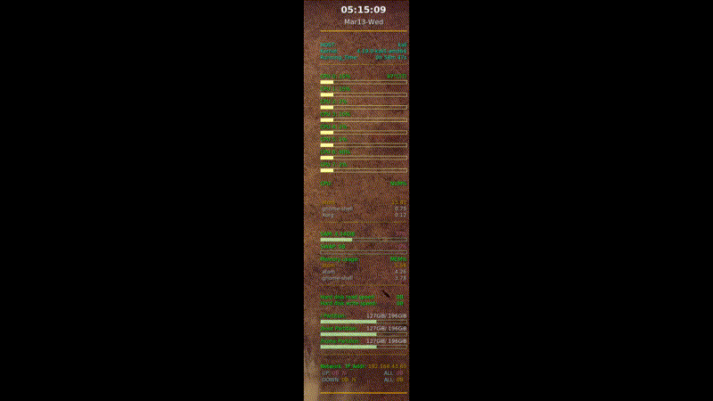

# Kali Linux(Debian) Beautify

> Linux真的是有毒，越用越能感受到他的魅力，快有一个多星期一直没有怎么干正事，捣腾Kali的美化以及一些其他软件的设定，感觉Linux配置好了每次使用都是一种享受

_生命不息，折腾不止_

[TOC]

## 桌面美化软件

### Cairo-Dock

> 感觉这个软件应该算是王者级的相对于其他几个软件，功能比较多，而且效果也比较好，玩了好久，但是也存在一些问题，比如在我的电脑上会对工作空间错误的计数，开的窗口稍微多一点就会有好几十个工作空间，但其实并没有那么多个（也有可能是我没有设置好）

最重要的是：**这个软件提供一个状态栏（应该是叫这个名字吧）就是相当于Windows下的右下角显示网络连接、音量，一些后台运行程序的小图标的那个区域，这个功能我还从来没有在Debian的系统中有见到那个插件可以实现（可能我没发现吧）**

像这样的一个，具体怎么显示也是可以设置的



#### 安装

`apt-get install cairo-dock`

#### 运行效果

> 不想放图片在这里了，因为太多了效果都还比较好看，懒得去做那么多GIF图像了

---

### Plank

> 建议直接去下载deb的包安装，之前使用`apt-get install plank`安装，之后运行有问题，然后换了安装之后就好了

貌似比较简单的就能配置了，没发现有动态效果就放弃了，这个软件就不演示了，感兴趣自己试试吧

---

### Gnome-Pie

这个软件比较好配置直接安装就好了，软件库里面有，配置起来也比较简单效果自己尝试一下就知道了

#### 安装

`apt-get install gnome-pie`

#### 运行效果


---

### Latte Dock

这个软件感觉比**Cairo-Dock**要差一点，功能少一点，个别时候不太稳定，我的电脑刚开机的时候能加载起来，后面就不知道去哪里了，效果可以自己设置，里面的选择比较多，感兴趣自己尝试一下，找到自己喜欢的就可以动画效果比CD少很多，安装软件包在**Software**文件夹里面

#### 安装

`gedbi latte-dock_0.7.4-0ubuntu2_amd64.deb`

#### 运行效果


---

## 系统信息监控软件

### Conky

#### 安装

> Debian下可以直接用这两个命令安装，没有的话，添加**更新源**`apt-get update`一下，应该就可以啦
```shell
apt-get install conky
apt-get install conky-all
gedbi conky-manager-v2.4-amd64.deb
```

#### 配置文件

我在网上找了一些大佬写的配置文件，挑了几个写的不错的（还有我的机子上能跑的，跑不出来的默认放弃），收集到我的这里，想用哪个的时候可以换一下，理论上是可以自己写的，但是实在是没有那么多时间再去研究这个（或者懒）
> 配置文件就放在**Conky_configrc**文件夹里面用的时候修改一下文件名就行了，再复制到用户目录下（大概和Desktop一个路径，前面一定要有一个点  **'**.**'** ，保存成隐藏文件)

#### Conky的自启动

某位大佬这样说道：
> 网上关于conky的开机自启动都是ubuntu的，在gnome下我试了rc.local, service都不行，最后只能用gnome的启动管理。

配置方法：
> 在~/.config/autostart/下面新建一个conky.desktop文件，内容如下：

```shell
[Desktop Entry]
Type=Application
Name=Conky
Comment=Start conky script
Exec=conky -d        ##命令自己help查看一下就可以啦
OnlyShowIn=GNOME
X-GNOME-Autostart-Phase=Application
Name[en_US]=conky.desktop
```

#### 运行效果



### 其他系统信息监控的软件不想去试了
